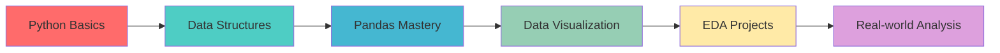
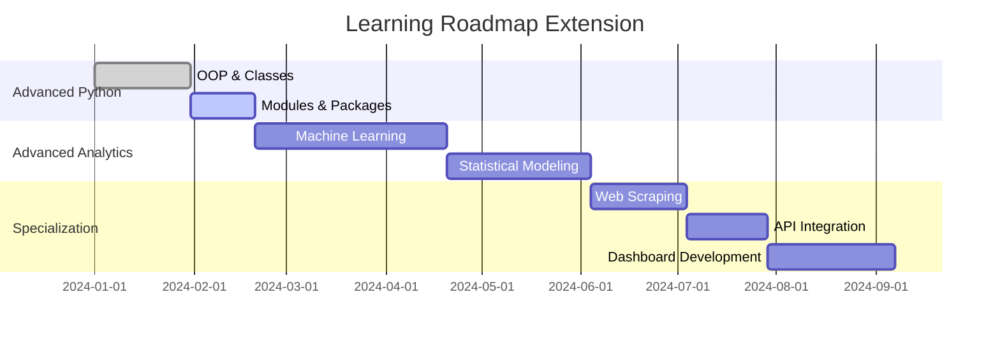

# 🐍 Python and Data Analysis for RURS

<div align="center">


[](https://github.com/yourusername/Python-certification-course-by-RURS)
[](https://github.com/yourusername/Python-certification-course-by-RURS)

**📚 My Personal Journey Through Python & Data Analysis**

*Rajshahi University Research Society (RURS) Certification Course*

---

</div>

## 🎯 Project Overview

> **From Zero to Data Analyst** - This repository chronicles my complete transformation from Python beginner to data analysis practitioner through the RURS certification program.

This isn't just another course repository. It's a **comprehensive documentation** of my learning journey, featuring:

- 📊 **Real-world data analysis projects**
- 🧠 **Personal notes and insights**  
- 💻 **Hands-on coding challenges**
- 📈 **Progressive skill development**

### 🌟 Why This Repository Stands Out

| Feature | Description |
|---------|-------------|
| 🎨 **Beginner-Friendly** | Step-by-step progression from basics to advanced |
| 🔥 **Practical Focus** | Real datasets, real problems, real solutions |
| 📝 **Personal Touch** | My actual notes, struggles, and breakthroughs |
| 🚀 **Future-Ready** | Extensible structure for advanced topics |

---

## 🛣️ Learning Roadmap

<details>
<summary><b>📖 Course Curriculum Overview</b></summary>



</details>

### 🎓 Skills Mastered

<table>
<tr>
<td width="50%">

**🐍 Python Fundamentals**
- Variables & Data Types
- Control Flow & Loops  
- Functions & Modules
- File I/O Operations
- Error Handling

</td>
<td width="50%">

**📊 Data Analysis**
- Pandas DataFrame Operations
- Data Cleaning & Preprocessing
- Statistical Analysis
- Data Aggregation & Grouping
- Time Series Basics

</td>
</tr>
<tr>
<td width="50%">

**📈 Data Visualization**
- Matplotlib Foundations
- Seaborn Statistical Plots
- Custom Chart Creation
- Interactive Visualizations
- Dashboard Basics

</td>
<td width="50%">

**🔍 Exploratory Data Analysis**
- Dataset Profiling
- Pattern Recognition
- Outlier Detection
- Correlation Analysis
- Insight Generation

</td>
</tr>
</table>

---

## 📁 Repository Structure

```
📦 Python-certification-course-by-RURS/
├── 📚 class_resources/          # Course materials & references
│   ├── 📖 books/
│   ├── 🎯 slides/
│   └── 💡 examples/
├── 📝 shared_notes/             # Instructor resources
├── 🧠 my_notes/                 # Personal study notes
├── 🏃‍♂️ warmups/                   # Practice exercises
├── 📅 week1/                    # Python Basics
│   ├── 🎓 lectures/
│   ├── 📋 assignments/
│   ├── 📊 exam/
│   └── 💻 my_solutions/
├── 📅 week2/                    # Data Structures & Pandas
├── 📅 week3/                    # Data Visualization
├── 📅 week4/                    # EDA & Analysis
└── 🚀 projects/                 # Capstone projects
    ├── 📈 mini_projects/
    └── 🎯 final_project/
```

---

## 🌟 Featured Projects

<div align="center">

### 🏆 Highlight Projects

</div>

| Project | Description | Technologies | Status |
|---------|-------------|--------------|---------|
| 📊 **Sales Data Analysis** | Complete EDA on retail dataset | `Pandas` `Matplotlib` `Seaborn` | ✅ Complete |
| 🏠 **Housing Price Prediction** | Statistical analysis & visualization | `NumPy` `Pandas` `Plotly` | 🔄 In Progress |
| 📈 **Stock Market Trends** | Time series analysis project | `Pandas` `Matplotlib` `Yahoo Finance` | 📋 Planned |

---

## 📊 My Learning Stats

<div align="center">


</div>

---

## 💭 Personal Reflections

> ### 🚀 My Transformation Story

<blockquote>
<details>
<summary><b>Click to read my journey...</b></summary>

**Before RURS:** I could barely write a Python `print()` statement without googling the syntax.

**After Week 1:** Understanding variables and loops felt like unlocking a new language.

**After Week 2:** Pandas DataFrames became my new best friend for handling data.

**After Week 3:** Creating my first meaningful visualization was a "wow" moment.

**After Week 4:** I realized I wasn't just coding anymore—I was *thinking* like a data analyst.

**Today:** I can take a messy CSV file and turn it into actionable insights. That's powerful! 💪

</details>
</blockquote>

### 🎯 Key Breakthroughs

- **Week 1:** 🧠 Grasped the logic of programming 
- **Week 2:** 📊 Fell in love with data manipulation
- **Week 3:** 🎨 Discovered the art of storytelling through visuals
- **Week 4:** 🔍 Learned to ask the right questions from data

---

## 🔮 Future Roadmap

<div align="center">

### 🛤️ What's Next?

</div>



### 🎯 Planned Additions

| Topic | Timeline | Priority |
|-------|----------|----------|
| 🤖 **Machine Learning Basics** | Next 2 months | 🔥 High |
| 🌐 **Web Scraping** | Month 3 | 🟡 Medium |
| ⚡ **Advanced Pandas** | Ongoing | 🔥 High |
| 📊 **Interactive Dashboards** | Month 4 | 🟡 Medium |
| 🐍 **Object-Oriented Python** | Next month | 🟡 Medium |

---

## 🤝 Connect & Collaborate

<div align="center">

### 📫 Let's Connect!

[](https://linkedin.com/in/yourprofile)
[](mailto:youremail@example.com)
[](https://yourportfolio.com)

</div>

### 🌟 Support This Journey

If this repository helped you in your Python learning journey:

- ⭐ **Star this repo** to show your support
- 🍴 **Fork it** to create your own learning path  
- 🐛 **Open issues** for questions or suggestions
- 🤝 **Contribute** improvements or additional resources

---

## 📄 License & Credits

<div align="center">

**📚 Course Credits:** Rajshahi University Research Society (RURS)

**📝 Instructor:** Roni Mahbub 

**📝 Repository Maintained By:** Soumitro Kumar Das


---


**⚡ "Data is the new oil, Python is the refinery!"**

[](https://github.com/yourusername)

</div>
